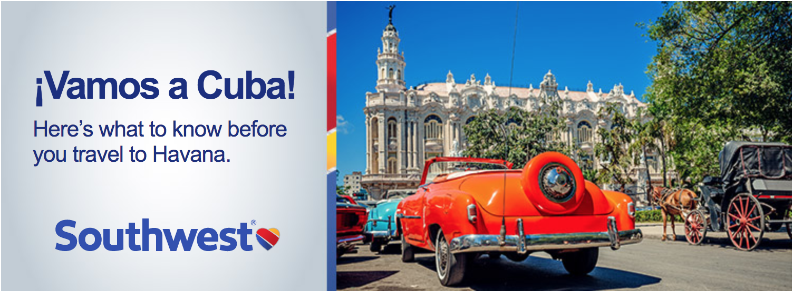
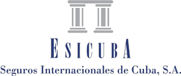
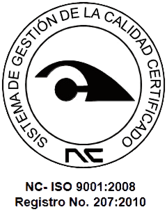

## Visa

Esta página tiene el objetivo de presentar información sobre los requerimientos
de trámites para
viajar a Cuba. Tratamos de lograr que nuestros consejos sean tan exhaustivos,
detallados y precisos como nos resulta posible. Sin embargo le rogamos su
comprensión de la complejidad de este tema considerando:

* la naturaleza de las solicitudes de VISA, en particular el hecho que
  cada país de orígen puede requerir información específica para realizar la
  solicitud de Visa e imponer procedimientos específicos que varían
  de acuerdo a la categoría de Visa y al país de destino
* la influencia de los vínculos contractuales con cierto contratista u empleador
* las diferentes regulaciones y tipos de situaciones migratorias y de ciudadanía
  admitidas por diferentes países
* las situaciones especiales de viajeros solicitando VISA para
  arribar a un país de destino estando en otro que no está relacionado con el de
  su ciudadanía
* los acuerdos bilaterales entre naciones para temas migratorios
* los aspectos específicos de la legislación vigente en lo que concierne a la
  organización de conferencias en Cuba.
* otros factores muy específicos que influencian la aprobación de solicitudes
  de Visa
* las diferencias de cobertura de seguro en los diferentes países
* las equivalencias monetarias de las coberturas a nivel internacional
* las regulaciones sobre condiciones de salud pre-existentes e implicaciones
  a futuro de tratamientos y procedimientos médicos
* los acuerdos bilaterales entre empresas aseguradoras

Por favor, confirme en su país la información antes de viajar.

******************************************************************

#### Trámites de VISA

Los trámites de solicitudes de VISA son gestionados por la
[Universidad de Sancti Spiritus](http://uniss.edu.cu). Las instrucciones
incluídas en esta página han sido comprobadas por el
personal de esta institución especializado en estos trámites para la realización
de eventos internacionales aprobados por el Ministerio de Educación Superior
de Cuba.

#### Trámites de Visa para ciudadanos de los Estados Unidos de América e Israel

Los **ciudadanos de los Estados Unidos de América** e **Israel**
son requeridos de solicitar una **VISA A-6**. Este tipo de Visa es de 
**caracter obligatorio** para los ciudadanos de estos países que viajen a
Cuba para participar en **cualquier evento** no gubernamental atendido o 
auspiciado por los organismos u organizaciones cubanas. Utilice el
[formulario de Solicitud de Visa General](http://bit.ly/visa-cuba-general)
Los participantes deben especificar como **motivos del viaje**
**Participación en conferencia SciPyLA 2017 y YayaboCiencia 2017**. El
**organismo cubano responsable de su viaje** sería la
**Universidad de Sancti Spiritus "José Martí"**. Si Usted ha propuesto una
actividad y esta ha sido aceptada, incluya el título de la misma en 
las **observaciones**, por ejemplo **Charla aceptada: Título de mi charla**.
En caso contrario solamente incluya en las **observaciones**
uno de los textos **Participante** o
**Invitado por los Organizadores**, según sea el caso.

#### Trámites de VISA para ciudadanos de otros países

Una referencia bien documentada y realmente práctica (aunque de ninguna
manera puede ser considereada oficial) es
[esta página sobre políticas de VISA de Cuba](http://bit.ly/wikipedia-en-visa-cuba).
Consúltela para determinar:

* si los ciudadanos de su país no necesitan solicitar VISA para viajar a Cuba
* o si pueden viajar a Cuba con una tarjeta de turista
* si solicitar VISA es un trámite obligatorio para los ciudadanos de su país
* si está prohibida la entrada a Cuba para los ciudadanos de su país

El siguiente mapa le puede dar una rápida idea de cual es su situación , pero no deje de consultar la página antes referida.

#### Casos de excención de Visa

No necesitan solicitar Visa, las personas en posesión de una Visa válida
durante la duración del evento, siempre que sean de uno de los siguientes tipos

* **C-1** : Se expide a los extranjeros invitados por visitas protocolares de alto nivel.
* **C-2** : Se expide a las personalidades extranjeras invitadas por las organizaciones políticas, sociales y de masas.
* **D-1** *(Técnicos y científicos)* : Se expide a los extranjeros técnicos, científicos o que por su especial calificación, sean contratados por los organismos oficiales cubanos para trabajar en Cuba, por el tiempo que se indique en el contrato y aquellos que en virtud de convenios de colaboración requieran entrar al país.
* **D-2** *(Estudiantes y becarios)* : Se expide a los estudiantes y becarios extranjeros admitidos en Cuba por un centro de estudio, investigaciones o adiestramiento, seleccionados conforme a los programas de intercambios, cooperación y colaboración educacional de Cuba.
* **D-3** *(Artistas)* : Se expide a extranjeros que arriben al territorio nacional para ejercer su arte.
* **D-4** *(Deportistas)* : Los deportistas o auxiliares de equipos de deporte e integrantes de delegaciones deportivas en general, extranjeros que arriben a Cuba con ese carácter.
* **D-5** *(Asilados políticos y refugiados)*
* **D-7** *(Representantes comerciales o agentes de negocios)* : Se otorga a los extranjeros que viajen a Cuba para dedicarse a actividades comerciales o de negocios con el consentimiento expreso de los organismos autorizados en Cuba para ello.
* **E-1** : Se expide a los extranjeros que soliciten residir permanentemente en Cuba con ciudadanos cubanos que sean sus padres o hijos, acreditando debidamente el parentesco, asi como el cónyuge, siempre que el matrimonio se haya efectuado de acuerdo a las leyes cubanas.
* **E-2** : Se otorga a extranjeros que no se encuentren dentro de la definición anterior, siempre que obtengan la visa y la autorización expresa de la Dirección de Inmigración y Extranjería.

Las personas que hayan ingresado al territorio nacional de Cuba con una Visa de
tipo *D-6* (periodistas), *D-8* (motivos religiosos), *D-10* (tratamiento médico),
*B-1*, *B-2*, *B-3*, *B-4*, *B-5*, *B-6* (Visa diplomática) o alguna otra
categoría, deben [contactar a los organizadores](../../#contact-div) con
antelación de estar interesados en asistir a la conferencia.

#### Tarjetas de turismo

La Visa de turismo (i.e. **visa A-1**) o tarjeta turística
es válida para una sola entrada al territorio nacional de Cuba en un viaje
de 30 días (90 días para los ciudadanos de Canadá) y se puede prorrogar
por un período igual al que fue expedida contactando el buró del
hotel donde se hospeda el viajero o acudiendo en persona ante las autoridades de
inmigración y extranjería.

##### Viajes directos desde Estados Unidos de América

Las ciudadanos de cualquier país del mundo que realicen un viaje directo desde
los Estados Unidos de América a Cuba deben adquirir las tarjetas de turismo
que ofrecen las compañías norteaméricanas. Estas tarjetas son diferentes a las
expedidas para visitantes provenientes de otras regiones del mundo.
Es una buena práctica adquirir la tarjeta de turismo en la agencia de viajes
o aerolínea junto con su pasaje de avión o crucero. En particular hemos
confirmado el procedimiento previamente con
[Southwest](https://www.southwest.com) . Esta aerolínea ofrece las rutas
[Fort Lauderdale, FL (FLL) -> Havana (HAV)](TODO) y
[Tampa, FL (TPA) -> Havana (HAV)](TODO) . Por favor lea las instrucciones
ofrecidas por Southwest a los visitantes extranjeros. 

Al comprar la tarjeta de turista y abordar al avión el viajero le será presentado
un formulario. Entre la información a proporcionar se encuentra el motivo del
viaje (también conocida como licencia o categoría de viaje). Los participantes
a la conferencia SciPyLA 2017 viajan bajo la categoría 
**Professional research or meetings** de la
[licencia de excepción general de OFAC](https://www.treasury.gov/resource-center/sanctions/Programs/Documents/cuba_faqs_new.pdf).

##### Tarjetas de turismo en Canadá, Reino Unido, Europa, Australia y Nueva Zelanda

TODO: cubavisas.com ?

##### Tarjetas de turismo en otros países

Las condiciones de adquisición y los proveedores de tarjetas de turismo pueden
cambiar de un país de orígen a otro. Si Usted tiene conocimiento de las gestiones
necesarias para hacer este trámite en su país, por favor
[edite este documento en un fork en Github](TODO) y
[envíenos un pull request](TODO).
Nosotros trataremos de incluir sus contribuciones con la mayor brevedad
que nos sea posible ya que la actualización de esta guía le facilitará el
trámite a otros participantes .

#### Solicitud de Visa de turismo

Utilice el
[formulario de Solicitud de Visa de Turismo](http://bit.ly/visa-cuba-tour)
para llenar los datos de solicitud de Visa de turismo para viajar a Cuba.
Su solicitud de VISA debe ser enviada posteriormente a una de las sedes de las 
[misiones diplómaticas cubanas](TODO) con oficinas de trámites consulares.

#### Carta de invitación al evento.

Si necesita una carta de los organizadores para adjuntarla a su solicitud
de Visa, por favor [contáctenos](../../#contact-div) enviando un mensaje
via e-mail a la dirección `2017@scipyla.org`.
Le recomendamos que solicite la carta de invitación al evento para aclarar
de forma expedita cualquier duda que pueda haber sobre las razones de su viaje.

#### Documentación requerida para el viaje

Antes de viajar le recomendamos consultar la [guía de Southwest para viajeros internacionales](http://bit.ly/travel-doc). No podemos garantizar que esta
información esté actualizada. Por favor confirme los detalles en el país de
orígen antes de su viaje.

## Seguros

En muchos casos la compra de su pasaje de avión incluye otros beneficios,
tales como el seguro médico. Infórmese sobre este particular antes de realizar
su viaje. De no incluir seguro de ningún tipo, o en caso que se desee extender
la cobertura de servicios, por favor consulte el
[sitio web de ESICuba](http://www.esicuba.cu/index.php/nuestros-seguros/personas).
Le aconsejamos que preste atención a
[la solicitud de seguro individual para astos médicos](http://www.esicuba.cu/images/documentos/solicitudes/ESI%2098017_03-Individuales%20y-o%20Familiares%20%2801092014%29.pdf)
y las [condiciones generales de este servicio](http://www.esicuba.cu/images/documentos/solicitudes/ESI%2098017_05%20%2801042016%29.pdf);
así como
[la solicitud de seguro de asistencia al viajero](http://www.esicuba.cu/images/documentos/solicitudes/ESI%2004051_03%20%2801012013%29.pdf)
y sus [condiciones generales](http://www.esicuba.cu/images/documentos/ESI%2004051_05%20CG02%20(01092016).pdf).

#### Cobertura de seguro

Destinados a personas que viajan desde o hacia Cuba, incluyendo aquellas que de forma temporal o a más largo plazo permanecen en el país.

Estos seguros satisfacen las regulaciones actuales del país sobre la entrada de viajeros y la estancia de extranjeros en el territorio nacional y cumplimentan los requerimientos de visado de los diferentes países incluyendo la Unión Europea.

Los productos que se ofrecen son combinaciones de coberturas de gastos médicos y repatriación con la inclusión de otras convenientes para resolver situaciones en las que los viajeros se pueden encontrar inmersos.

##### Seguro de Viajes

* Gastos Médicos por Enfermedad y Accidente
* Repatriaciones
* Anticipo de Fondos
* Seguro de Accidente
* Equipaje
* Gestión de documentos
* Otros gastos
 
##### Seguro de Gastos Médicos

*  Hospitalización y Cuidados Intensivos
*  Gastos médicos quirúrgicos y no quirúrgicos
*  Gastos clínicos y especiales
*  Cirugía y tratamiento ambulatoria
*  Traslados sanitarios
*  Maternidad y Gastos del recién nacido
*  Urgencia médica de enfermedad preexistente y/o congénita
*  Odontología de Urgencia
*  Oftalmología
*  Medicamentos
*  Repatriación

TODO: Homologación de seguro existente en país de orígen.

